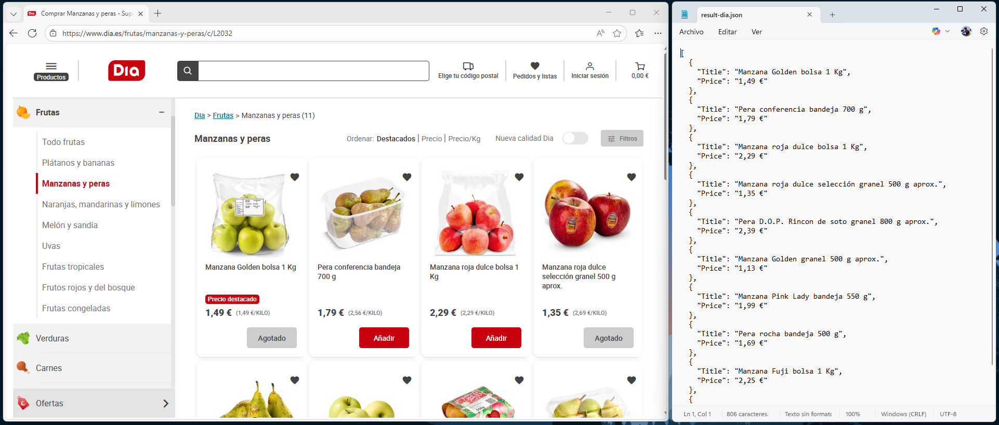

# Playwright.SDK

Proyecto experimental para explorar la funcionalidad de **Microsoft.Playwright** y la automatización de navegadores web.

> ⚠️ Este proyecto es solo para aprendizaje y demostración personal. No está pensado para producción.

---

## Descripción

**Playwright.SDK** permite navegar, interactuar y extraer datos de páginas web de forma programática, ideal como **proof of concept** para automatización de navegadores y web scraping.
- Funciona de forma similar a **Puppeteer**

---

## Características principales

- **Soporte multi-navegador**: Chromium, Firefox y más
- **Modos de visualización**: Headless o visible
- **Interacción completa**: Clicks, navegación, espera de selectores
- **Extracción de datos estructurados**: Obtención dinámica de información haciendo uso de  `dynamic[]`
- **Ejecución de JavaScript**: Ejecuta código personalizado en el contexto del navegador
- **Exportación JSON**: Serializa los datos extraídos en formato JSON

---

## Ejemplo de uso 🚀

```csharp
var driver = await Playwright.SDK.DriverFactory.CreateDriver();
var browser = await driver.OpenBrowser("path/to/chrome.exe", Playwright.SDK.BrowserType.Chromium, headless: false);

await browser.Navigate("https://www.example.com/products");
await browser.WaitForSelector("#onetrust-accept-btn-handler");
await browser.Click("#onetrust-accept-btn-handler");

// Extraer elementos
var ruleSet = new Dictionary<string, string>
{
    { "Title", ".product-title" },
    { "Price", ".product-price" }
};

var products = await browser.ExtractElements(".product-card", ruleSet);
Console.WriteLine(System.Text.Json.JsonSerializer.Serialize(products));
```

---

## Tecnologías

- **.NET 10**
- **Microsoft.Playwright**

---

## Demo

<p align="center">
  
</p>
