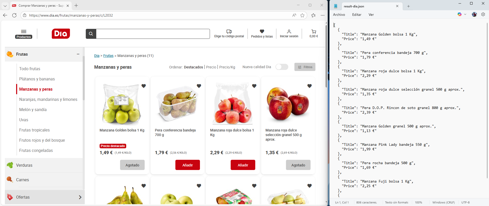

# Playwright.SDK

Experimental project to play around **Microsoft.Playwright** and it's web automation and scraping capabilities.

> ⚠️ This project is for learning and personal demonstration purposes only. It is not intended for production.

---

## Description

**Playwright.SDK** allows navigating and interacting with a web browser programatically. This can be useful for web automation (testing) and scraping.
- Works similarly to **Puppeteer** 

---

## Main features

- **Multi-browser support**: Chromium, Firefox and more
- **Visualization modes**: Headless or visible
- **Complete interaction**: Clicks, navigation, wating for selectors and code execution
- **Data extraction in structured format**: Makes use of `dynamic[]` without strong typing
- **JavaScript execution**: Allows JavaScript execution in the browser's context

---

## Usage

```csharp
var driver = await Playwright.SDK.DriverFactory.CreateDriver();
var browser = await driver.OpenBrowser("path/to/chrome.exe", Playwright.SDK.BrowserType.Chromium, headless: false);

await browser.Navigate("https://www.example.com/products");
await browser.WaitForSelector("#onetrust-accept-btn-handler");
await browser.Click("#onetrust-accept-btn-handler");

// Extraer elementos
var ruleSet = new Dictionary<string, string>
{
    { "Title", ".product-title" },
    { "Price", ".product-price" }
};

var products = await browser.ExtractElements(".product-card", ruleSet);
Console.WriteLine(System.Text.Json.JsonSerializer.Serialize(products));
```

---


## Example

<p align="center">
  
</p>


## Technologies

- **.NET 10**
- **Microsoft.Playwright**

---